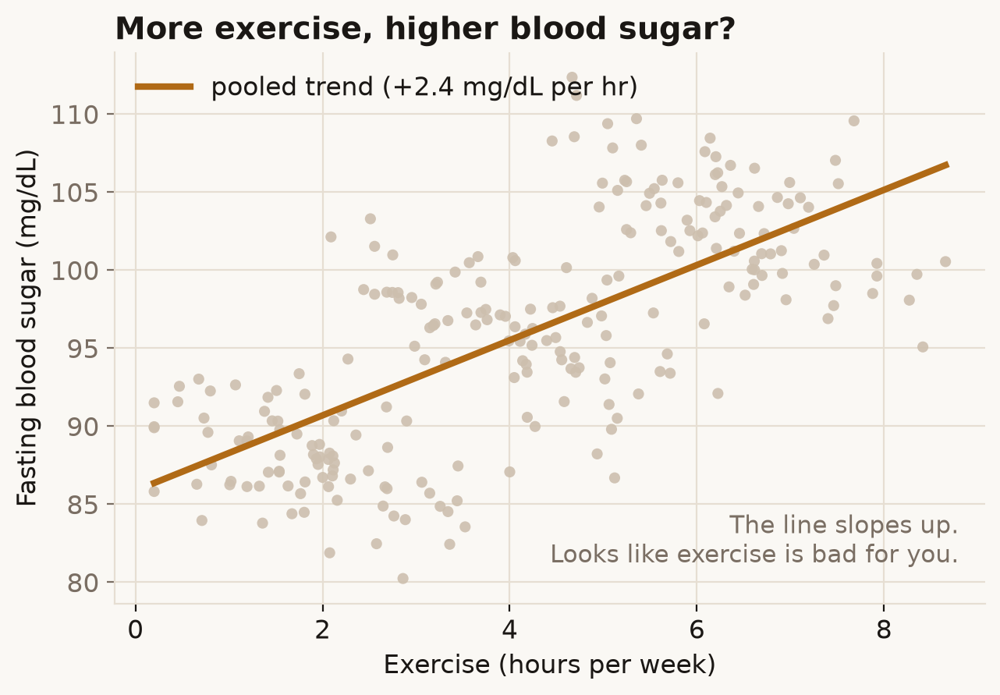
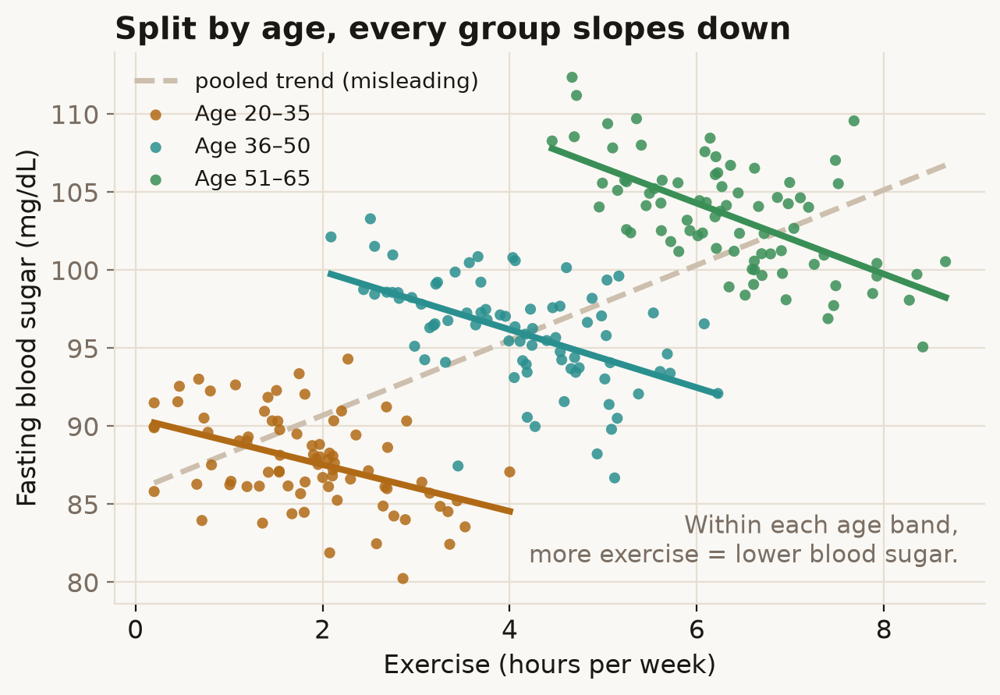
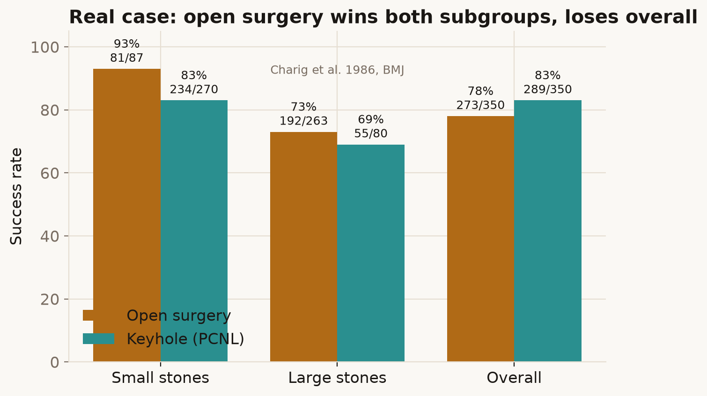

# 01 — Simpson's Paradox

*When a trend that holds in every group reverses once you pool the groups together.*

## The hook

Imagine a health study. You plot weekly exercise against fasting blood sugar for a
few hundred people and fit a line through the cloud:

The line slopes **up**. Taken at face value: the more people exercise, the *higher*
their blood sugar. Exercise looks bad for you. That can't be right — and it isn't.

## The reveal

Colour the same points by age band and fit a line through each one:

Inside *every* age band the line slopes **down**: more exercise, lower blood sugar,
exactly as you'd expect. The upward pooled line (now dashed) was an illusion.

Nothing about the data changed between the two pictures. The only difference is
whether we looked at age. That reversal — true in every subgroup, false in the
whole — is **Simpson's paradox**.

## Why it reverses

There's a lurking third variable, a *confounder*, doing the damage. In this dataset
age is wired to two things at once:

- **Older people exercise more** (their cloud sits to the right), and
- **Older people run higher blood sugar** (their cloud sits higher).

So when you ignore age, the cloud of points marches up and to the right — not
because exercise raises blood sugar, but because exercise is standing in for age,
and age raises blood sugar. The pooled line measures the wrong thing. Once you hold
age fixed by splitting into bands, exercise gets to show its real, downward effect.

The data here is synthetic and built to be clean, so you can see the mechanism. But
this is not a toy problem — it shows up in real published studies.

## A real, documented case: kidney stones

In 1986 Charig and colleagues compared two treatments for kidney stones in the
*BMJ*: traditional **open surgery** versus **keyhole surgery (PCNL)**.

Look at the overall column: keyhole wins, 83% vs 78%. But split by stone size and it
flips — open surgery wins for **small** stones (93% vs 83%) *and* for **large**
stones (73% vs 69%). It wins both subgroups yet loses the total.

The confounder is which patients got which treatment. Doctors steered the *easy*
cases (small stones) toward the newer keyhole method and the *hard* cases (large
stones) toward open surgery. So keyhole's overall score was flattered by an easier
caseload. Stone size is the age-band of this story. ([Charig et al. 1986][charig])

The same reversal made headlines in the **Berkeley admissions** case: in 1973 the
university looked like it admitted men at a higher rate than women overall, yet
department by department, if anything it slightly *favoured* women. Women had simply
applied in greater numbers to the most competitive departments. ([Bickel, Hammel &
O'Connell 1975][berkeley])

## How not to get fooled

- **Always plot the subgroups, not just the pooled line.** If a relationship looks
  surprising, ask what's different about the points at each end.
- **Ask "what else changes along the x-axis?"** Here, age changed along with
  exercise. There's your confounder.
- **A weighted-average can lie about every part it's made of.** An overall rate is a
  mix; the mixing proportions can flip the headline.
- **There is no purely statistical fix.** Whether you should trust the pooled trend
  or the subgroups depends on *why* the confounder is there — that's a causal
  question, not a numerical one. (Pearl's "sure-thing" discussion is the deep end of
  this; Blyth named the paradox in 1972. ([Blyth 1972][blyth]))

## Sources

- E. H. Simpson (1951), *The Interpretation of Interaction in Contingency Tables*,
  Journal of the Royal Statistical Society, Series B, 13(2): 238–241. The original.
- C. R. Blyth (1972), *On Simpson's Paradox and the Sure-Thing Principle*, JASA,
  67(338): 364–366 — coined the name "Simpson's paradox". ([link][blyth])
- P. J. Bickel, E. A. Hammel & J. W. O'Connell (1975), *Sex Bias in Graduate
  Admissions: Data from Berkeley*, Science, 187(4175): 398–404.
  doi:10.1126/science.187.4175.398. ([link][berkeley])
- C. R. Charig, D. R. Webb, S. R. Payne & J. E. Wickham (1986), *Comparison of
  treatment of renal calculi by open surgery, percutaneous nephrolithotomy, and
  extracorporeal shockwave lithotripsy*, BMJ, 292(6524): 879–882.
  doi:10.1136/bmj.292.6524.879. ([link][charig])
- R. A. Kievit, W. E. Frankenhuis, L. J. Waldorp & D. Borsboom (2013), *Simpson's
  paradox in psychological science: a practical guide*, Frontiers in Psychology, 4:
  513 — a modern, readable primer. ([link][kievit])

[blyth]: https://doi.org/10.1080/01621459.1972.10482387
[berkeley]: https://doi.org/10.1126/science.187.4175.398
[charig]: https://doi.org/10.1136/bmj.292.6524.879
[kievit]: https://doi.org/10.3389/fpsyg.2013.00513

---

**Try it:** open [`toy.html`](toy.html) and drag the slider from *Ignore age* to
*Reveal age* to watch the single upward trend break into three downward ones.

*The exercise/age figures use synthetic data generated by [`build.py`](build.py)
with a fixed seed; the kidney-stone figure uses the real counts from Charig et al.*
